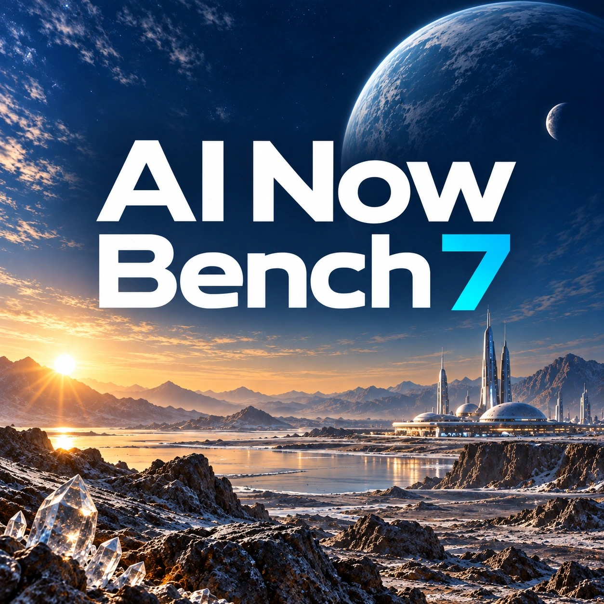

  

<h1 align="center">AI Now Bench 7</h1>

**A free Windows PC benchmark for CPU, graphics, memory, storage, AI compute, and everyday workloads.**

AI Now Bench 7 (AINowBench) brings **63 scored results across six categories** into one benchmark, with local reports and optional online comparisons. Developed by [AI Creations Now Software Development](https://aicreatenow.com/).

  <a href="https://ainowbench.com/download.html">Download for Windows</a> · <a href="https://ainowbench.com/">Product website</a> · <a href="https://ainowbench.com/instructions.html">Getting started</a> · <a href="https://results.aicreatenow.com/">Results Center</a>

  

<strong>63 scored results · 6 performance categories · Free Standard benchmark</strong>

  <a href="#what-it-measures">Features</a> · <a href="#free-standard-and-optional-advanced-pro">Standard &amp; Advanced</a> · <a href="#requirements">Requirements</a> · <a href="#get-started">Quick start</a> · <a href="#privacy-and-sharing">Privacy</a> · <a href="#support">Support</a>

## What it measures

| Category | Scored results | Focus |
| --- | ---: | --- |
| Graphics | 9 | Rendering, frame rates, and GPU compute |
| CPU | 16 | Single-thread and multithread processor performance |
| Memory | 3 | Bandwidth and latency |
| Storage | 8 | Read and write performance |
| AI Compute | 10 | AI workloads, including inference and semantic search |
| Real World | 17 | Practical workloads such as photo processing, compilation, PDF work, and media processing |

The 63 results include multiple measurements from some workloads; they are not 63 separate applications. Review the [full test catalog](https://ainowbench.com/tools.html) for measured tests, estimates, and compatibility details.

- **Local reports:** review your measurements and scores in PDF and TXT reports.
- **Scoring you can inspect:** see how category weights and rating tiers contribute to the overall result in the [scoring methodology](https://ainowbench.com/methodology.html).
- **Optional comparisons:** share an eligible completed Standard run with the [Results Center](https://results.aicreatenow.com/) and [compare systems](https://results.aicreatenow.com/explore).
- **Optional diagnostics:** use Advanced Pro for deeper graphics analysis, CPU/GPU/RAM stress tests, and custom test durations.

## Free Standard and optional Advanced Pro

| Mode | What's included | Access |
| --- | --- | --- |
| Standard benchmark | All 63 scored results, local benchmark reports, and optional Results Center comparisons | Free; no Advanced key or purchase required |
| Advanced Pro | Additional diagnostics, full GPU analysis, CPU/GPU/RAM stress suites, and custom test durations | Optional license key: free by email, or an optional $5 contribution for priority key delivery |

Both Advanced key routes unlock the same features. Advanced diagnostics are separate from the scored Standard comparison. Contributions support the project and do not influence scores.

[Request a free Advanced key or view priority delivery](https://ainowbench.com/download.html#advanced). The official download page has current delivery details.

## Requirements

| Component | Minimum |
| --- | --- |
| Operating system | Windows 11 Home or Pro, or Windows Server 2022 or 2025; x64 |
| Processor | Single-socket Intel or AMD CPU with at least 2 physical cores |
| Memory | 4 GB RAM |
| Storage | 80 GB available space; a traditional hard drive should sustain at least 100 MB/s read speed |
| Graphics | Integrated graphics or supported Windows WARP software rendering; a dedicated GPU is optional |

Dual-socket systems are not supported. Some graphics and AI workloads depend on compatible hardware and drivers; software rendering can produce lower or more variable results. See the [complete requirements](https://ainowbench.com/instructions.html#system-requirements) for recommended configurations.

Administrator approval is required for hardware access and prerequisites. Setup includes required runtimes and its private workload environment; a separate system-wide Python installation is not needed.

## Get started

1. Download the [Windows x64 installer](https://ainowbench.com/download.html). The [official download page](https://ainowbench.com/download.html) lists release details and the SHA-256 checksum. A [Microsoft Store listing](https://apps.microsoft.com/detail/xp9cqkq6cn3f6j?hl=en-US&gl=US) is also available; release timing can differ by channel.
2. Review the requirements and [EULA and privacy notice](https://ainowbench.com/privacy-policy.txt), then install.
3. Save your work, close heavy background applications, and check that your system has suitable cooling and power.
4. Select a full **Standard / Recommended** run and review the comparison-sharing choice before starting. **Uncheck sharing for local-only reports.**
5. Review your local reports when the run finishes. If you chose to share an eligible run, use its Result ID in the Results Center.

Run time depends on your hardware and operating conditions. See the [example run times](https://ainowbench.com/instructions.html#benchmark-runtime) and [release changelog](https://ainowbench.com/AINowBench-7.0-Changelog.txt).

## Privacy and sharing

No account is required to install, run, or receive local reports. **The comparison checkbox is initially selected**, and the application saves your sharing choice for later launches. Uncheck it before starting to keep that run local.

With sharing selected, an eligible completed Standard run sends its complete technical TXT report to the Results Center. That report can include Windows user/computer names, local paths, hardware details, measurements, and diagnostics. Public result pages use selected, sanitized fields; the full technical TXT is not intended for public download. Advanced diagnostics remain local.

Read the [benchmark privacy page](https://ainowbench.com/privacy.html) and [full privacy notice](https://ainowbench.com/privacy-policy.txt) before sharing. Send full technical reports through private support rather than posting them in public issues.

## Support

Email **[info@aicreatenow.com](mailto:info@aicreatenow.com)** with your application version, Windows version, a description of the issue, and steps to reproduce it. Include a Result ID when relevant. For privacy or result-removal requests, use the same address.

## Source and licensing

AI Now Bench is proprietary software distributed under its publisher's [EULA](https://ainowbench.com/privacy-policy.txt). This repository provides product information and documentation; **the application source code is not included**. No open-source license for the application is granted by this repository.

Bundled third-party components retain their own licenses and notices. Product names and trademarks belong to their respective owners; their inclusion does not imply endorsement or affiliation.

---

Built by <a href="https://github.com/aicreatenowdom">AI Creations Now Software Development</a> · <a href="https://ainowbench.com/download.html">Download AI Now Bench 7</a> · <a href="https://results.aicreatenow.com/">Explore the Results Center</a>

